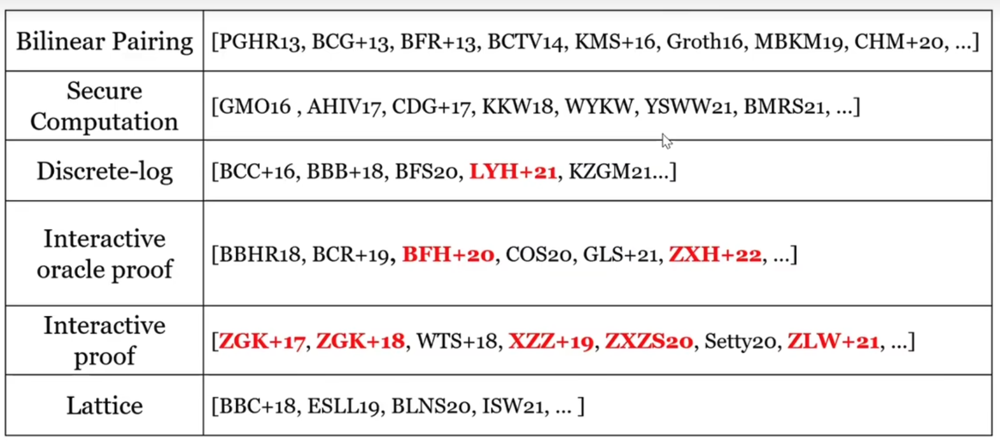

# ZKPedia

This repository is _an encyclo**pedia** of **Z**ero **K**nowledge **P**roof._ Zero Knowledge Proof (**ZKP**) is a special family of Verifiable Computing (**VC**) which has an extra property called Zero Knowledge, actually. It has been proved that any VC system can be converted into a zero-knowledge version additionally. So it is important for researchers to learn VC system as well. The repository records the basic concepts of **VC** and **ZKP**, and a series of important articles and books in these areas (which are classical or novel achievements from a aspect of academic), along with some actual applications in various scienarios as well.

The repository is also for recording my personal researches in Verifiable Computing and Zero Knowledge Proof area.

We'd like to collect other awesome materials as well, if they are related. Any useful revisions and pull requests (PR) are welcomed!

## [Introduction](introduction.md)&#x20;

What's Zero Knowledge Proof? And what does zk-SNARKs, zk-STARK... mean? What about interactive proofs and non-interactive proofs? Here gives an overview of these "profound" terms.

## Tech Terms

These are some important technique terms (or, preliminaries, in a researcher's tongue) that may be learned before diving into this area. Some of the terms may appear during the journey as well.

* [Group, Ring and Field](tech-terms/group-ring-and-field.md)
* [Schwartz-Zippel Lemma](tech-terms/schwartz-zippel-lemma.md)
* [Commitment](tech-terms/commitment/)
  * Polynomial Commitment
  * Vector Commitment
* Probabilistically Checkable Proof (PCP)
* Bilinear Paring
* [Low Degree Extension](tech-terms/low-degree-extention-lde.md)
*   Quadratic Span Program (QSP), Quadratic Arithmetic Program (QAP)

    * [Quadratic Span Programs and Succinct NIZKs without PCPs](https://eprint.iacr.org/2012/215)

## Articles and Books

Articles and books of awesome and beautiful implementations that introduce ZK argument systems and other cryptography primitives in recent years.

Parts of the contents are inspired by the below graph from a [speech](https://www.bilibili.com/video/BV17W4y1278w/?spm\_id\_from=333.999.0.0\&vd\_source=8b61d5dfa42b49437a734c2590cca7cd) given by Yupeng, Zhang.

<figure><figcaption></figcaption></figure>

### Pioneer Work

#### GMR85, GMR89

* [The knowledge complexity of interactive proof-systems](https://dl.acm.org/doi/abs/10.1145/3335741.3335750)
* The concept of interactive proof is introduced. And the distinction between public coin and private coin (whether the verifier’s randomness is open/visible to the prover) is proved to be not crucial in the follow works.
* Give an argument system that proof consists of 8 group elements and the verification cost of the verifier is some exponentiations and checking pairing product equation of 6 pairings.

#### Fiat-Shamir Heuristic

* How to prove yourself: Practical solutions to identification and signature problems

### Interactive Proof Based Protocols

#### CMT12

* [Practical verified computation with streaming interactive proofs](https://doi.org/10.1145/2090236.2090245)

#### GKR08, GKR15

* [Delegating Computation: Interactive Proofs for Muggles](https://dl.acm.org/doi/10.1145/2699436)
* This work have 2 different version, one in STOC08, the other in JACM15.

#### GKR Note

* [A Note on the GKR Protocol](https://people.cs.georgetown.edu/jthaler/GKRNote.pdf)

#### vSQL/ZGK17

* [vSQL: Verifying Arbitrary SQL Queries over Dynamic Outsourced Databases](https://eprint.iacr.org/2017/1145)

#### Hyrax/WTS+18

* [Doubly-Efficient zkSNARKs Without Trusted Setup](https://eprint.iacr.org/2017/1132.pdf)
* Doubly-Efficient: Means efficiency for both the prover and the verifier.

#### Libra/XZZ19

* [Libra: Succinct Zero-Knowledge Proofs with Optimal Prover Computation](https://link.springer.com/chapter/10.1007/978-3-030-26954-8\_24)

#### Virgo/ZXZ+20

* [Transparent Polynomial Delegation and Its Applications to Zero Knowledge Proof](https://eprint.iacr.org/2019/1482)

#### Spartan/Setty20

* [Spartan: Efficient and general-purpose zkSNARKs without trusted setup](http://link.springer.com/10.1007/978-3-030-56877-1\_25)

#### Virgo++/ZLW+21

* [Doubly Efficient Interactive Proofs for General Arithmetic Circuits with Linear Prover Time](https://doi.org/10.1145/3460120.3484767)

### Bilinear Pairing Based Protocols

These protocols are designed based on the bilinear pairing assumption. And they are non-interactive proof systems.

#### GGPR13

* [Quadratic Span Programs and Succinct NIZKs without PCPs](https://eprint.iacr.org/2012/215)
* Found an insightful construction of polynomial equations based on Lagrange interpolation polynomials yielding a pairing-based NIZK argument with a CRS size proportional to the size of the statement and witness.

#### Pinocchio/PGHR13

* [Pinocchio: nearly practical verifiable computation](https://dl.acm.org/doi/10.1145/2856449)
* Give an argument system that proof consists of 8 group elements and the verification cost of the verifier is some exponentiations and checking pairing product equation of 6 pairings.

#### BCTV14

* [Scalable, transparent, and post-quantum secure computational integrity](https://eprint.iacr.org/2018/046)
* [Succinct Non-Interactive Zero Knowledge for a von Neumann Architecture](https://eprint.iacr.org/2013/879.pdf)

#### Groth16

* [On the Size of Pairing-Based Non-interactive Arguments](http://link.springer.com/10.1007/978-3-662-49896-5\_11)
  * A beautiful proof for the notions: **completeness, soundness** and **zero knowledge**, which is worth learning for researchers.
* Give an argument system for arithmetic circuit where a proof consists of only 3 group elements. And the verifier just needs to compute a number of exponentiations proportional to the statement size and check a single pairing product equation, which only has 3 pairings.

#### Sonic/MBKM19

* [Sonic: Zero-Knowledge SNARKs from Linear-Size Universal and Updatable Structured Reference Strings](https://dl.acm.org/doi/10.1145/3319535.3339817)

### Interactive Oracle Proof Based Protocols

#### ZXH22

* [Polynomial Commitment with a One-to-Many Prover and Applications](https://www.usenix.org/conference/usenixsecurity22/presentation/zhang-jiaheng)

## Applications

_To be finished._

__

## Other Learning Materials

_To be finished._
